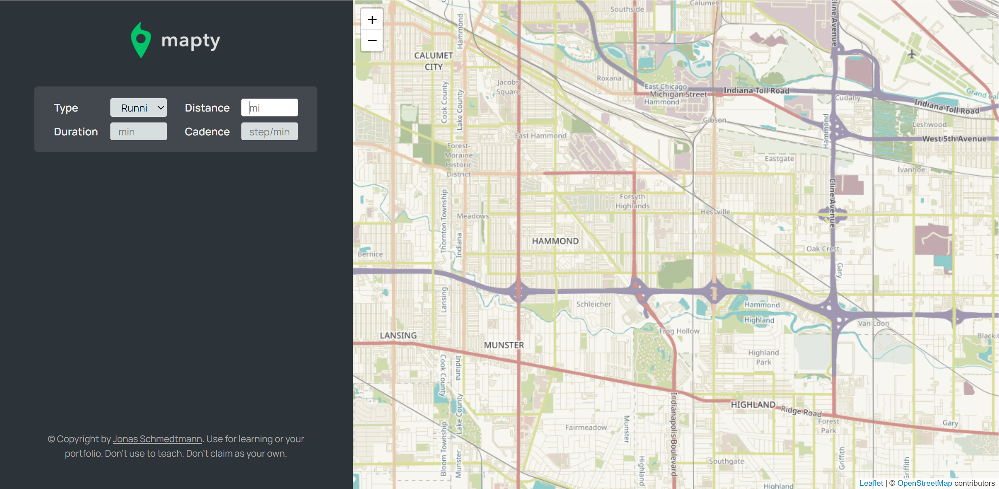

# Mapty-Application
This project is for building up a workout tracker by using JavaScript in OOP architecture, DOM, Geolocation, Leaflet library, and localStorage API. A form will first be created 
after user clicking on the map position, once the user successfully submits the form, then a marker will be displayed on the corresponding position of the map. Since the data is already set up as storing in
the localStorage, meaning that the user won't lose the data even if they close the page. ***The HTML5 and CSS3 templates are given by the Udemy instructor Jonas Schmedtmann***.

### Home Page

